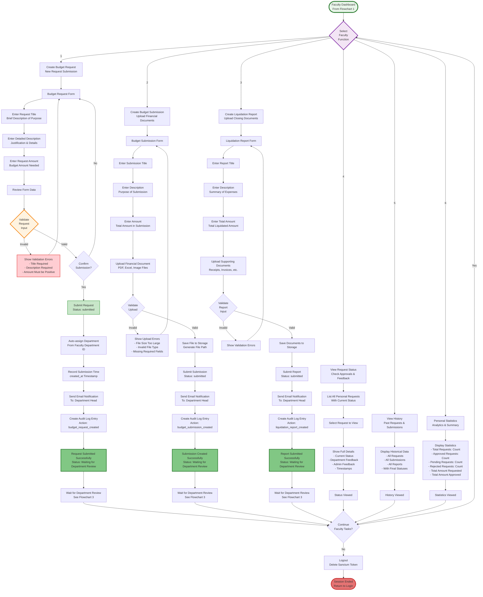
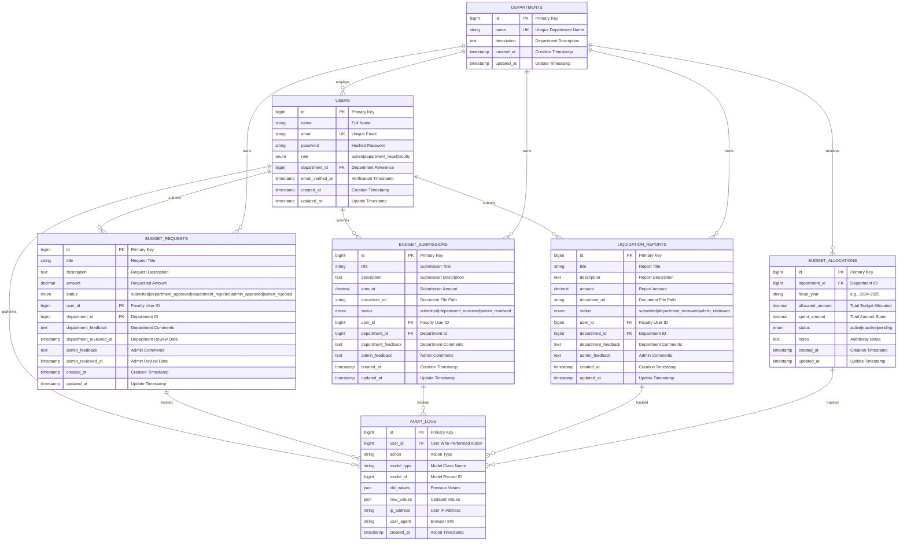
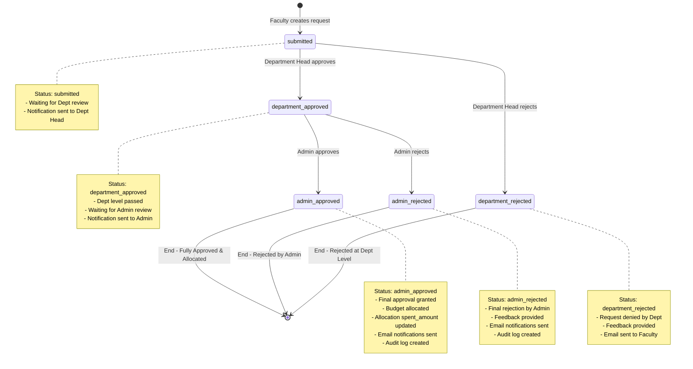
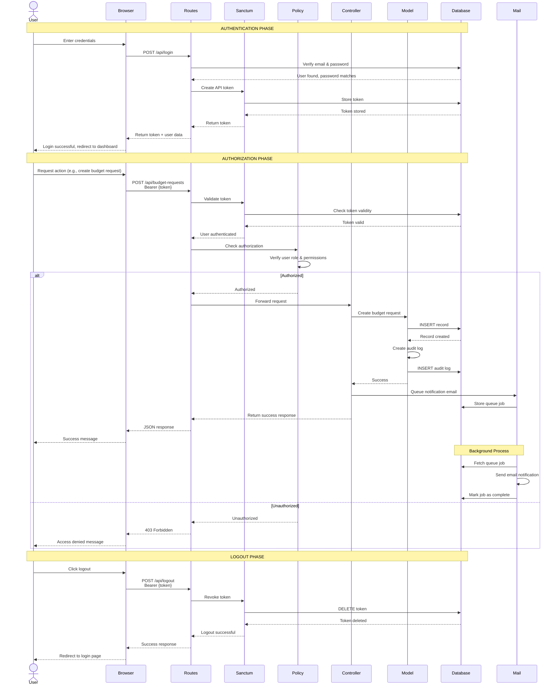
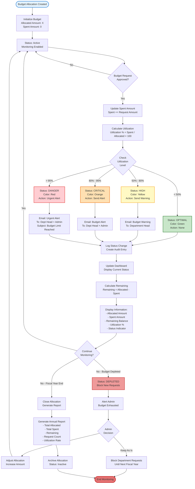

# Budget Tracking System - Complete System Flowchart
## For Capstone/Research Paper Documentation

---

## Complete Unified System Workflow
### End-to-End Process Flow - Authentication to Completion

```mermaid
flowchart TD
    %% ===== AUTHENTICATION PHASE =====
    START([System Access<br/>Budget Tracking System]) --> LOGIN[User Enters Credentials<br/>Email & Password]
    LOGIN --> AUTH_PROCESS[Authentication Process<br/>Verify Against Database]
    AUTH_PROCESS --> AUTH_CHECK{Credentials<br/>Valid?}
    
    AUTH_CHECK -->|No| LOGIN_FAIL[Login Failed<br/>Display Error Message]
    LOGIN_FAIL --> RETRY{Retry<br/>Login?}
    RETRY -->|Yes| LOGIN
    RETRY -->|No| END_FAIL([Access Denied])
    
    AUTH_CHECK -->|Yes| CREATE_TOKEN[Create Sanctum API Token<br/>Generate Bearer Token]
    CREATE_TOKEN --> STORE_SESSION[Store Session Data<br/>User Info + Token]
    STORE_SESSION --> GET_ROLE[Retrieve User Role<br/>From Database]
    GET_ROLE --> ROLE_CHECK{Determine<br/>User<br/>Role}
    
    %% ===== ROLE ROUTING =====
    ROLE_CHECK -->|Admin| ADMIN_DASH[ADMIN DASHBOARD<br/>System Administrator View]
    ROLE_CHECK -->|Department Head| DEPT_DASH[DEPARTMENT DASHBOARD<br/>Department Management View]
    ROLE_CHECK -->|Faculty/Staff| FACULTY_DASH[FACULTY DASHBOARD<br/>Personal Requests View]
    
    %% ===== ADMIN WORKFLOW =====
    ADMIN_DASH --> ADMIN_MENU{Select<br/>Admin<br/>Function}
    
    ADMIN_MENU -->|User Management| USER_MGMT[Create/Manage Users<br/>All Roles & Departments]
    ADMIN_MENU -->|Budget Allocation| BUDGET_ALLOC[Create Budget Allocations<br/>Assign Department Budgets]
    ADMIN_MENU -->|Final Approval| FINAL_APPROVAL[Review Department-Approved<br/>Budget Requests]
    ADMIN_MENU -->|View Reports| VIEW_ALL[View All Submissions<br/>& Liquidation Reports]
    ADMIN_MENU -->|Analytics| ADMIN_ANALYTICS[System-wide Analytics<br/>& Statistics]
    ADMIN_MENU -->|Audit Logs| AUDIT_TRAIL[View Complete<br/>Audit Trail]
    
    USER_MGMT --> CREATE_USER[Create New User]
    CREATE_USER --> USER_FORM[Enter User Details<br/>Name, Email, Role, Department]
    USER_FORM --> VALIDATE_USER{Validate<br/>User Data}
    VALIDATE_USER -->|Invalid| USER_ERROR[Show Validation Errors]
    USER_ERROR --> USER_FORM
    VALIDATE_USER -->|Valid| SAVE_USER[Save User to Database<br/>Hash Password with Bcrypt]
    SAVE_USER --> SEND_WELCOME[Send Welcome Email<br/>With Login Credentials]
    SEND_WELCOME --> USER_COMPLETE[User Created Successfully]
    
    BUDGET_ALLOC --> SELECT_DEPT_A[Select Department]
    SELECT_DEPT_A --> ENTER_FISCAL[Enter Fiscal Year<br/>e.g., 2024-2025]
    ENTER_FISCAL --> ENTER_AMOUNT[Enter Allocated Amount<br/>Total Budget for Department]
    ENTER_AMOUNT --> SET_STATUS_A[Set Allocation Status<br/>Active/Inactive/Pending]
    SET_STATUS_A --> ADD_NOTES[Add Notes Optional]
    ADD_NOTES --> VALIDATE_ALLOC{Validate<br/>Allocation}
    VALIDATE_ALLOC -->|Invalid| ALLOC_ERROR[Show Validation Errors]
    ALLOC_ERROR --> SELECT_DEPT_A
    VALIDATE_ALLOC -->|Valid| CHECK_DUPLICATE{Check if<br/>Allocation<br/>Exists}
    CHECK_DUPLICATE -->|Yes| DUPLICATE_ERROR[Error: Allocation Already Exists]
    DUPLICATE_ERROR --> SELECT_DEPT_A
    CHECK_DUPLICATE -->|No| SAVE_ALLOCATION[Save Budget Allocation<br/>Spent Amount = 0.00]
    SAVE_ALLOCATION --> NOTIFY_DEPT_HEAD_A[Send Email Notification<br/>to Department Head]
    NOTIFY_DEPT_HEAD_A --> LOG_ALLOC[Create Audit Log Entry]
    LOG_ALLOC --> ALLOC_COMPLETE[Allocation Created<br/>Monitoring Activated]
    
    FINAL_APPROVAL --> VIEW_PENDING[View Pending Requests<br/>Status: department_approved]
    VIEW_PENDING --> SELECT_REQUEST[Select Request to Review]
    SELECT_REQUEST --> REVIEW_DETAILS[Review Request Details<br/>Title, Amount, Description<br/>Department Feedback]
    REVIEW_DETAILS --> ADMIN_DECISION{Admin<br/>Decision}
    
    ADMIN_DECISION -->|Approve| ADMIN_APPROVE_PROCESS[Approve Request]
    ADMIN_APPROVE_PROCESS --> UPDATE_STATUS_APPROVED[Update Status<br/>Status: admin_approved]
    UPDATE_STATUS_APPROVED --> ADD_ADMIN_FEEDBACK[Add Admin Feedback Comments]
    ADD_ADMIN_FEEDBACK --> UPDATE_SPENT[Update Budget Allocation<br/>Spent Amount += Request Amount]
    UPDATE_SPENT --> CALCULATE_UTIL[Calculate Utilization<br/>Utilization % = Spent/Allocated × 100]
    CALCULATE_UTIL --> SEND_APPROVAL_EMAIL[Send Email Notifications<br/>To: Faculty + Department Head]
    SEND_APPROVAL_EMAIL --> LOG_APPROVAL[Create Audit Log<br/>Action: admin_approved]
    LOG_APPROVAL --> ADMIN_APPROVAL_COMPLETE[Request Fully Approved<br/>Budget Allocated]
    
    ADMIN_DECISION -->|Reject| ADMIN_REJECT_PROCESS[Reject Request]
    ADMIN_REJECT_PROCESS --> UPDATE_STATUS_REJECTED[Update Status<br/>Status: admin_rejected]
    UPDATE_STATUS_REJECTED --> ADD_REJECTION_REASON[Add Rejection Reason<br/>Required Feedback]
    ADD_REJECTION_REASON --> SEND_REJECTION_EMAIL[Send Email Notifications<br/>To: Faculty + Department Head<br/>Include Rejection Reason]
    SEND_REJECTION_EMAIL --> LOG_REJECTION[Create Audit Log<br/>Action: admin_rejected]
    LOG_REJECTION --> ADMIN_REJECTION_COMPLETE[Request Rejected by Admin]
    
    USER_COMPLETE --> ADMIN_CONTINUE{Continue<br/>Admin Tasks?}
    ALLOC_COMPLETE --> ADMIN_CONTINUE
    ADMIN_APPROVAL_COMPLETE --> ADMIN_CONTINUE
    ADMIN_REJECTION_COMPLETE --> ADMIN_CONTINUE
    VIEW_ALL --> ADMIN_CONTINUE
    ADMIN_ANALYTICS --> ADMIN_CONTINUE
    AUDIT_TRAIL --> ADMIN_CONTINUE
    
    ADMIN_CONTINUE -->|Yes| ADMIN_MENU
    ADMIN_CONTINUE -->|No| LOGOUT_ADMIN[Logout<br/>Delete Sanctum Token]
    LOGOUT_ADMIN --> END_SESSION([Session Ended])
    
    %% ===== DEPARTMENT HEAD WORKFLOW =====
    DEPT_DASH --> DEPT_MENU{Select<br/>Department<br/>Function}
    
    DEPT_MENU -->|1| DEPT_USER_MGMT[User Management<br/>Create Faculty in Department]
    DEPT_MENU -->|2| REVIEW_REQUESTS[Review Budget Requests<br/>From Faculty Members]
    DEPT_MENU -->|3| REVIEW_SUBMISSIONS[Review Budget Submissions<br/>Financial Documents]
    DEPT_MENU -->|4| REVIEW_LIQUIDATIONS[Review Liquidation Reports<br/>Closing Documents]
    DEPT_MENU -->|5| VIEW_ALLOCATION[View Department Allocation<br/>Budget Status & Utilization]
    DEPT_MENU -->|6| DEPT_ANALYTICS[Department Analytics<br/>Statistics & Reports]
    
    %% Create Faculty Path
    DEPT_USER_MGMT --> FACULTY_FORM[Enter Faculty Details<br/>Name, Email, Password]
    FACULTY_FORM --> SET_DEPT[Auto-assign to Department<br/>Department ID from Dept Head]
    SET_DEPT --> VALIDATE_FACULTY{Validate<br/>Faculty Data}
    VALIDATE_FACULTY -->|Invalid| FACULTY_ERROR[Show Validation Errors]
    FACULTY_ERROR --> FACULTY_FORM
    VALIDATE_FACULTY -->|Valid| SAVE_FACULTY[Save Faculty User<br/>Role: faculty]
    SAVE_FACULTY --> FACULTY_CREATED[Faculty Created Successfully]
    
    %% Review Budget Requests Path
    REVIEW_REQUESTS --> LIST_REQUESTS[List Department Requests<br/>Status: submitted]
    LIST_REQUESTS --> SELECT_REQ[Select Request to Review]
    SELECT_REQ --> VIEW_REQ_DETAILS[View Request Details<br/>Title, Amount, Description<br/>Faculty Name]
    VIEW_REQ_DETAILS --> DEPT_DECISION{Department<br/>Head<br/>Decision}
    
    DEPT_DECISION -->|Approve| DEPT_APPROVE_PROCESS[Approve Request Level 1]
    DEPT_APPROVE_PROCESS --> UPDATE_DEPT_APPROVED[Update Status<br/>Status: department_approved]
    UPDATE_DEPT_APPROVED --> ADD_DEPT_FEEDBACK[Add Department Feedback<br/>Optional Comments]
    ADD_DEPT_FEEDBACK --> RECORD_REVIEW_TIME[Record Review Timestamp<br/>department_reviewed_at]
    RECORD_REVIEW_TIME --> NOTIFY_FACULTY_APPROVED[Send Email to Faculty<br/>Request Approved at Dept Level]
    NOTIFY_FACULTY_APPROVED --> NOTIFY_ADMIN_QUEUE[Send Email to Admin<br/>Queue for Final Approval]
    NOTIFY_ADMIN_QUEUE --> LOG_DEPT_APPROVAL[Create Audit Log<br/>Action: department_approved]
    LOG_DEPT_APPROVAL --> QUEUE_FOR_ADMIN[Queue for Admin Review<br/>See Flowchart 2 - Final Approval]
    QUEUE_FOR_ADMIN --> DEPT_APPROVE_COMPLETE[Department Approval Complete]
    
    DEPT_DECISION -->|Reject| DEPT_REJECT_PROCESS[Reject Request]
    DEPT_REJECT_PROCESS --> UPDATE_DEPT_REJECTED[Update Status<br/>Status: department_rejected]
    UPDATE_DEPT_REJECTED --> ADD_REJECTION_FEEDBACK[Add Rejection Feedback<br/>Required - Explain Reason]
    ADD_REJECTION_FEEDBACK --> RECORD_REJECT_TIME[Record Review Timestamp<br/>department_reviewed_at]
    RECORD_REJECT_TIME --> NOTIFY_FACULTY_REJECTED[Send Email to Faculty<br/>Include Rejection Reason]
    NOTIFY_FACULTY_REJECTED --> LOG_DEPT_REJECTION[Create Audit Log<br/>Action: department_rejected]
    LOG_DEPT_REJECTION --> DEPT_REJECT_COMPLETE[Request Rejected<br/>End of Workflow]
    
    %% Review Submissions Path
    REVIEW_SUBMISSIONS --> LIST_SUBMISSIONS[List Department Submissions<br/>Status: submitted]
    LIST_SUBMISSIONS --> SELECT_SUB[Select Submission to Review]
    SELECT_SUB --> VIEW_SUB_DETAILS[View Submission Details<br/>Download & Review Documents]
    VIEW_SUB_DETAILS --> DEPT_SUB_DECISION{Review<br/>Documents}
    
    DEPT_SUB_DECISION -->|Approved| DEPT_SUB_APPROVE[Mark as Reviewed<br/>Status: department_reviewed]
    DEPT_SUB_APPROVE --> ADD_SUB_FEEDBACK[Add Review Comments]
    ADD_SUB_FEEDBACK --> NOTIFY_SUB_ADMIN[Notify Admin for Final Review]
    NOTIFY_SUB_ADMIN --> SUB_APPROVED_COMPLETE[Submission Reviewed<br/>Queued for Admin]
    
    DEPT_SUB_DECISION -->|Needs Revision| DEPT_SUB_REVISE[Request Revisions]
    DEPT_SUB_REVISE --> ADD_REVISION_NOTES[Add Revision Notes<br/>What Needs to Change]
    ADD_REVISION_NOTES --> NOTIFY_FACULTY_REVISE[Notify Faculty<br/>Request Revisions]
    NOTIFY_FACULTY_REVISE --> SUB_REVISION_COMPLETE[Revision Requested<br/>Wait for Faculty Update]
    
    %% Review Liquidations Path
    REVIEW_LIQUIDATIONS --> LIST_LIQUIDATIONS[List Department Reports<br/>Status: submitted]
    LIST_LIQUIDATIONS --> SELECT_LIQ[Select Report to Review]
    SELECT_LIQ --> VIEW_LIQ_DETAILS[View Report Details<br/>Review Supporting Documents]
    VIEW_LIQ_DETAILS --> DEPT_LIQ_DECISION{Review<br/>Liquidation}
    
    DEPT_LIQ_DECISION -->|Approved| DEPT_LIQ_APPROVE[Mark as Reviewed<br/>Status: department_reviewed]
    DEPT_LIQ_APPROVE --> ADD_LIQ_COMMENTS[Add Review Comments]
    ADD_LIQ_COMMENTS --> NOTIFY_LIQ_ADMIN[Notify Admin for Final Review]
    NOTIFY_LIQ_ADMIN --> LIQ_APPROVED_COMPLETE[Report Reviewed<br/>Queued for Admin]
    
    DEPT_LIQ_DECISION -->|Issues Found| DEPT_LIQ_ISSUE[Request Clarification]
    DEPT_LIQ_ISSUE --> ADD_ISSUE_NOTES[Add Issue Notes<br/>What Needs Clarification]
    ADD_ISSUE_NOTES --> NOTIFY_FACULTY_ISSUE[Notify Faculty<br/>Request Clarification]
    NOTIFY_FACULTY_ISSUE --> LIQ_ISSUE_COMPLETE[Clarification Requested<br/>Wait for Faculty Response]
    
    %% Continue or Logout
    FACULTY_CREATED --> DEPT_CONTINUE{Continue<br/>Dept Tasks?}
    DEPT_APPROVE_COMPLETE --> DEPT_CONTINUE
    DEPT_REJECT_COMPLETE --> DEPT_CONTINUE
    SUB_APPROVED_COMPLETE --> DEPT_CONTINUE
    SUB_REVISION_COMPLETE --> DEPT_CONTINUE
    LIQ_APPROVED_COMPLETE --> DEPT_CONTINUE
    LIQ_ISSUE_COMPLETE --> DEPT_CONTINUE
    VIEW_ALLOCATION --> DEPT_CONTINUE
    DEPT_ANALYTICS --> DEPT_CONTINUE
    
    DEPT_CONTINUE -->|Yes| DEPT_MENU
    DEPT_CONTINUE -->|No| LOGOUT_DEPT[Logout<br/>Delete Sanctum Token]
    LOGOUT_DEPT --> END_DEPT([Session Ended<br/>Return to Login])
    
    style START_DEPT fill:#e0f7fa,stroke:#00838f,stroke-width:4px
    style DEPT_MENU fill:#f3e5f5,stroke:#7b1fa2,stroke-width:3px
    style DEPT_DECISION fill:#fff3e0,stroke:#f57c00,stroke-width:3px
    style DEPT_APPROVE_PROCESS fill:#c8e6c9,stroke:#43a047,stroke-width:2px
    style DEPT_REJECT_PROCESS fill:#ffcdd2,stroke:#e53935,stroke-width:2px
    style DEPT_APPROVE_COMPLETE fill:#81c784,stroke:#2e7d32,stroke-width:3px
    style DEPT_REJECT_COMPLETE fill:#e57373,stroke:#c62828,stroke-width:3px
    style END_DEPT fill:#e57373,stroke:#c62828,stroke-width:3px
```



---

## FLOWCHART 4: Faculty Workflow (Page 4)
### Faculty Submissions and Request Management



---

## FLOWCHART 5: Budget Monitoring and System Maintenance (Page 5)
### Continuous Monitoring, Alerts, and Analytics

```mermaid
flowchart TD
    START_MONITOR([Budget Monitoring System<br/>Continuous Background Process]) --> INIT_MONITOR[Initialize Monitoring Service<br/>Load Active Allocations]
    
    INIT_MONITOR --> FETCH_ALLOCATIONS[Fetch All Active Allocations<br/>From Database]
    FETCH_ALLOCATIONS --> LOOP_START{For Each<br/>Active<br/>Allocation}
    
    LOOP_START -->|Process Allocation| GET_ALLOC_DATA[Get Allocation Data<br/>- Department ID<br/>- Fiscal Year<br/>- Allocated Amount<br/>- Spent Amount]
    
    GET_ALLOC_DATA --> CALCULATE_UTIL[Calculate Utilization<br/>Utilization % = Spent / Allocated × 100<br/>Remaining = Allocated - Spent]
    
    CALCULATE_UTIL --> CHECK_UTIL{Check<br/>Utilization<br/>Level}
    
    CHECK_UTIL -->|< 50%| STATUS_OPTIMAL[Status: OPTIMAL<br/>Color: Green<br/>Message: Budget Healthy]
    STATUS_OPTIMAL --> LOG_OPTIMAL[Log Status<br/>No Action Required]
    LOG_OPTIMAL --> NEXT_ALLOC
    
    CHECK_UTIL -->|50% - 80%| STATUS_WARNING[Status: HIGH USAGE<br/>Color: Yellow<br/>Message: Budget Usage High]
    STATUS_WARNING --> SEND_WARNING[Send Warning Email<br/>To: Department Head<br/>Subject: Budget Usage Alert<br/>Body: 50-80% utilized]
    SEND_WARNING --> LOG_WARNING[Log Warning Sent<br/>Create Audit Entry]
    LOG_WARNING --> UPDATE_DASH_WARNING[Update Dashboard<br/>Show Yellow Indicator]
    UPDATE_DASH_WARNING --> NEXT_ALLOC
    
    CHECK_UTIL -->|80% - 95%| STATUS_CRITICAL[Status: CRITICAL<br/>Color: Orange<br/>Message: Budget Nearly Exhausted]
    STATUS_CRITICAL --> SEND_CRITICAL[Send Critical Alert<br/>To: Department Head + Admin<br/>Subject: Critical Budget Alert<br/>Body: 80-95% utilized]
    SEND_CRITICAL --> LOG_CRITICAL[Log Critical Alert<br/>Create Audit Entry]
    LOG_CRITICAL --> UPDATE_DASH_CRITICAL[Update Dashboard<br/>Show Orange Indicator]
    UPDATE_DASH_CRITICAL --> NEXT_ALLOC
    
    CHECK_UTIL -->|> 95%| STATUS_DANGER[Status: DANGER<br/>Color: Red<br/>Message: Budget Limit Reached]
    STATUS_DANGER --> SEND_URGENT[Send Urgent Alert<br/>To: Department Head + Admin<br/>Subject: URGENT - Budget Limit<br/>Body: >95% utilized<br/>Priority: HIGH]
    SEND_URGENT --> LOG_URGENT[Log Urgent Alert<br/>Create Audit Entry]
    LOG_URGENT --> UPDATE_DASH_DANGER[Update Dashboard<br/>Show Red Indicator]
    UPDATE_DASH_DANGER --> CHECK_DEPLETED{Budget<br/>100%<br/>Depleted?}
    
    CHECK_DEPLETED -->|Yes| BLOCK_REQUESTS[Block New Requests<br/>Department Cannot Submit<br/>Until Budget Increased]
    CHECK_DEPLETED -->|No| NEXT_ALLOC
    
    BLOCK_REQUESTS --> NOTIFY_BLOCKED[Send Notification<br/>Department Budget Depleted<br/>Contact Admin to Increase]
    NOTIFY_BLOCKED --> NEXT_ALLOC
    
    NEXT_ALLOC{More<br/>Allocations?}
    NEXT_ALLOC -->|Yes| LOOP_START
    NEXT_ALLOC -->|No| WAIT_INTERVAL[Wait Monitoring Interval<br/>Check Every 1 Hour]
    
    WAIT_INTERVAL --> CHECK_TRIGGER{New Request<br/>Approved?}
    CHECK_TRIGGER -->|Yes| TRIGGER_UPDATE[Trigger Immediate Update<br/>Recalculate Utilization]
    TRIGGER_UPDATE --> FETCH_ALLOCATIONS
    CHECK_TRIGGER -->|No| FETCH_ALLOCATIONS
    
    %% Analytics Generation Path
    START_MONITOR --> ANALYTICS_SERVICE[Analytics Generation Service<br/>Parallel Process]
    
    ANALYTICS_SERVICE --> SCHEDULE_ANALYTICS{Analytics<br/>Request}
    
    SCHEDULE_ANALYTICS -->|Overview| GEN_OVERVIEW[Generate Overview Report<br/>- Total Requests Count<br/>- Total Amount Requested<br/>- Total Amount Approved<br/>- Approval Rate %<br/>- Average Processing Time]
    
    SCHEDULE_ANALYTICS -->|By Department| GEN_DEPT_REPORT[Generate Department Report<br/>- Requests per Department<br/>- Amount per Department<br/>- Utilization per Department<br/>- Top Spending Departments]
    
    SCHEDULE_ANALYTICS -->|Trends| GEN_TRENDS[Generate Trend Analysis<br/>- Monthly Request Count<br/>- Monthly Spending<br/>- Year-over-Year Comparison<br/>- Seasonal Patterns]
    
    SCHEDULE_ANALYTICS -->|Status Distribution| GEN_STATUS[Generate Status Report<br/>- Submitted Count<br/>- Department Approved Count<br/>- Admin Approved Count<br/>- Rejected Count<br/>- Pipeline Analysis]
    
    SCHEDULE_ANALYTICS -->|Forecast| GEN_FORECAST[Generate Forecast<br/>- Projected Spending<br/>- Budget Depletion Timeline<br/>- Recommended Allocations<br/>- Risk Assessment]
    
    GEN_OVERVIEW --> QUERY_DATA[Query Database<br/>Aggregate Data]
    GEN_DEPT_REPORT --> QUERY_DATA
    GEN_TRENDS --> QUERY_DATA
    GEN_STATUS --> QUERY_DATA
    GEN_FORECAST --> QUERY_DATA
    
    QUERY_DATA --> FILTER_BY_ROLE[Apply Role-based Filters<br/>Admin: All Data<br/>Dept Head: Department Data<br/>Faculty: Personal Data]
    
    FILTER_BY_ROLE --> PERFORM_CALCULATIONS[Perform Calculations<br/>- Aggregations<br/>- Averages<br/>- Percentages<br/>- Trends]
    
    PERFORM_CALCULATIONS --> FORMAT_RESULTS[Format Results<br/>Prepare JSON Response]
    
    FORMAT_RESULTS --> CACHE_ANALYTICS[Cache Analytics Results<br/>Cache Duration: 15 Minutes<br/>Improve Performance]
    
    CACHE_ANALYTICS --> RETURN_ANALYTICS[Return Analytics Data<br/>To Requesting User]
    
    RETURN_ANALYTICS --> DISPLAY_CHARTS[Display in Dashboard<br/>- Bar Charts<br/>- Line Graphs<br/>- Pie Charts<br/>- Data Tables]
    
    DISPLAY_CHARTS --> EXPORT_OPTION{Export<br/>Request?}
    
    EXPORT_OPTION -->|Yes - PDF| GENERATE_PDF[Generate PDF Report<br/>Formatted Document]
    EXPORT_OPTION -->|Yes - Excel| GENERATE_EXCEL[Generate Excel File<br/>Spreadsheet with Data]
    EXPORT_OPTION -->|Yes - CSV| GENERATE_CSV[Generate CSV File<br/>Comma-separated Data]
    EXPORT_OPTION -->|No| ANALYTICS_COMPLETE
    
    GENERATE_PDF --> DOWNLOAD_FILE[Download File<br/>Save to User Device]
    GENERATE_EXCEL --> DOWNLOAD_FILE
    GENERATE_CSV --> DOWNLOAD_FILE
    
    DOWNLOAD_FILE --> ANALYTICS_COMPLETE[Analytics Process Complete]
    
    ANALYTICS_COMPLETE --> LOG_ANALYTICS[Log Analytics Access<br/>Create Audit Entry]
    
    %% Audit Logging Service
    START_MONITOR --> AUDIT_SERVICE[Audit Logging Service<br/>Track All System Actions]
    
    AUDIT_SERVICE --> CAPTURE_ACTION{Action<br/>Triggered?}
    
    CAPTURE_ACTION -->|Create| LOG_CREATE[Log: Record Created<br/>Capture New Values]
    CAPTURE_ACTION -->|Update| LOG_UPDATE[Log: Record Updated<br/>Capture Old & New Values]
    CAPTURE_ACTION -->|Delete| LOG_DELETE[Log: Record Deleted<br/>Capture Deleted Values]
    CAPTURE_ACTION -->|Approve| LOG_APPROVE[Log: Approval Action<br/>Capture Status Change]
    CAPTURE_ACTION -->|Reject| LOG_REJECT[Log: Rejection Action<br/>Capture Status Change & Reason]
    CAPTURE_ACTION -->|Login| LOG_LOGIN[Log: User Login<br/>Capture Login Time]
    CAPTURE_ACTION -->|Logout| LOG_LOGOUT[Log: User Logout<br/>Capture Logout Time]
    
    LOG_CREATE --> BUILD_AUDIT_ENTRY[Build Audit Log Entry]
    LOG_UPDATE --> BUILD_AUDIT_ENTRY
    LOG_DELETE --> BUILD_AUDIT_ENTRY
    LOG_APPROVE --> BUILD_AUDIT_ENTRY
    LOG_REJECT --> BUILD_AUDIT_ENTRY
    LOG_LOGIN --> BUILD_AUDIT_ENTRY
    LOG_LOGOUT --> BUILD_AUDIT_ENTRY
    
    BUILD_AUDIT_ENTRY --> GET_USER_INFO[Get User Information<br/>- User ID<br/>- User Role<br/>- User Name]
    
    GET_USER_INFO --> GET_REQUEST_INFO[Get Request Information<br/>- IP Address<br/>- User Agent Browser<br/>- Request Timestamp]
    
    GET_REQUEST_INFO --> GET_MODEL_INFO[Get Model Information<br/>- Model Type Class<br/>- Model ID<br/>- Action Type]
    
    GET_MODEL_INFO --> PREPARE_VALUES[Prepare Values<br/>- Old Values JSON<br/>- New Values JSON<br/>- Mask Sensitive Data]
    
    PREPARE_VALUES --> SAVE_AUDIT_LOG[Save to Audit Logs Table<br/>Permanent Record]
    
    SAVE_AUDIT_LOG --> AUDIT_SAVED[Audit Entry Saved<br/>Action Tracked]
    
    AUDIT_SAVED --> CHECK_ADMIN_VIEW{Admin<br/>Viewing<br/>Audit Logs?}
    
    CHECK_ADMIN_VIEW -->|Yes| DISPLAY_AUDIT[Display Audit Logs<br/>Filterable List<br/>Search & Export]
    CHECK_ADMIN_VIEW -->|No| CONTINUE_MONITORING
    
    DISPLAY_AUDIT --> CONTINUE_MONITORING[Continue System Monitoring]
    
    LOG_ANALYTICS --> CONTINUE_MONITORING
    
    CONTINUE_MONITORING --> SYSTEM_HEALTH_CHECK{System<br/>Health<br/>Check}
    
    SYSTEM_HEALTH_CHECK -->|Healthy| FETCH_ALLOCATIONS
    SYSTEM_HEALTH_CHECK -->|Issue Detected| SEND_ADMIN_ALERT[Send Alert to Admin<br/>System Issue Detected]
    SEND_ADMIN_ALERT --> LOG_SYSTEM_ISSUE[Log System Issue]
    LOG_SYSTEM_ISSUE --> FETCH_ALLOCATIONS
    
    style START_MONITOR fill:#e3f2fd,stroke:#1976d2,stroke-width:4px
    style CHECK_UTIL fill:#fff3e0,stroke:#f57c00,stroke-width:3px
    style STATUS_OPTIMAL fill:#c8e6c9,stroke:#43a047,stroke-width:3px
    style STATUS_WARNING fill:#fff9c4,stroke:#f9a825,stroke-width:3px
    style STATUS_CRITICAL fill:#ffe0b2,stroke:#ef6c00,stroke-width:3px
    style STATUS_DANGER fill:#ffcdd2,stroke:#e53935,stroke-width:3px
    style BLOCK_REQUESTS fill:#ef9a9a,stroke:#c62828,stroke-width:3px
    style ANALYTICS_SERVICE fill:#f3e5f5,stroke:#7b1fa2,stroke-width:3px
    style AUDIT_SERVICE fill:#e1f5fe,stroke:#0277bd,stroke-width:3px
```



---

## System Architecture Diagram

This diagram illustrates the complete system architecture including all layers, components, and data flows.

```mermaid
graph TB
    subgraph "Presentation Layer"
        WEB[Web Browser Interface<br/>HTML, CSS, JavaScript]
        API_CLIENT[API Client<br/>Mobile/External Apps]
    end
    
    subgraph "API Gateway Layer"
        ROUTES[Laravel Routes<br/>api.php | web.php]
        MIDDLEWARE[Authentication Middleware<br/>Laravel Sanctum]
    end
    
    subgraph "Business Logic Layer"
        
        subgraph "Controllers"
            UC[User Controller<br/>User Management]
            DC[Department Controller<br/>Department CRUD]
            BRC[Budget Request Controller<br/>Request Workflow]
            BSC[Budget Submission Controller<br/>Document Management]
            LRC[Liquidation Report Controller<br/>Report Processing]
            BAC[Budget Allocation Controller<br/>Allocation Management]
            AC[Approval Controller<br/>Dashboard & Statistics]
            ALC[Audit Log Controller<br/>Activity Tracking]
            ANC[Analytics Controller<br/>Reporting & Insights]
        end
        
        subgraph "Authorization Policies"
            BRP[Budget Request Policy<br/>Request Authorization]
            BSP[Budget Submission Policy<br/>Submission Authorization]
            LRP[Liquidation Report Policy<br/>Report Authorization]
            UP[User Policy<br/>User Authorization]
        end
        
        subgraph "Domain Models"
            USER_MODEL[User Model<br/>Role-based Access]
            DEPT_MODEL[Department Model<br/>6 Departments]
            BR_MODEL[Budget Request Model<br/>Workflow Status]
            BS_MODEL[Budget Submission Model<br/>Document Tracking]
            LR_MODEL[Liquidation Report Model<br/>Financial Closing]
            BA_MODEL[Budget Allocation Model<br/>Fiscal Management]
            AL_MODEL[Audit Log Model<br/>Change Tracking]
        end
        
        subgraph "Services & Utilities"
            MAIL_SERVICE[Mail Service<br/>Email Notifications]
            FILTER_TRAIT[Filterable Trait<br/>Advanced Search]
            QUEUE_SERVICE[Queue Service<br/>Background Jobs]
            CACHE_SERVICE[Cache Service<br/>Performance Optimization]
        end
        
    end
    
    subgraph "Data Persistence Layer"
        DB[(MySQL Database<br/>Port 3307<br/>Relational Data)]
        FILE_STORAGE[(File Storage<br/>Document Repository<br/>Uploads)]
        CACHE_STORE[(Cache Store<br/>Redis/Memcached<br/>Session Data)]
    end
    
    subgraph "External Services"
        SMTP[SMTP Server<br/>Email Delivery<br/>Mailtrap/Gmail]
        CLOUD_STORAGE[Cloud Storage<br/>AWS S3/Local<br/>File Backup]
    end
    
    %% ========== CONNECTIONS ==========
    
    WEB --> ROUTES
    API_CLIENT --> ROUTES
    
    ROUTES --> MIDDLEWARE
    MIDDLEWARE --> UC & DC & BRC & BSC & LRC & BAC & AC & ALC & ANC
    
    UC --> UP
    BRC --> BRP
    BSC --> BSP
    LRC --> LRP
    
    UC --> USER_MODEL
    DC --> DEPT_MODEL
    BRC --> BR_MODEL
    BSC --> BS_MODEL
    LRC --> LR_MODEL
    BAC --> BA_MODEL
    ALC --> AL_MODEL
    AC --> BR_MODEL & BS_MODEL & LR_MODEL
    ANC --> BR_MODEL & BS_MODEL & BA_MODEL
    
    BR_MODEL --> MAIL_SERVICE
    BS_MODEL --> MAIL_SERVICE
    LR_MODEL --> MAIL_SERVICE
    
    BR_MODEL --> FILTER_TRAIT
    BS_MODEL --> FILTER_TRAIT
    LR_MODEL --> FILTER_TRAIT
    
    MAIL_SERVICE --> QUEUE_SERVICE
    ANC --> CACHE_SERVICE
    
    USER_MODEL --> DB
    DEPT_MODEL --> DB
    BR_MODEL --> DB
    BS_MODEL --> DB
    LR_MODEL --> DB
    BA_MODEL --> DB
    AL_MODEL --> DB
    
    BS_MODEL --> FILE_STORAGE
    LR_MODEL --> FILE_STORAGE
    
    CACHE_SERVICE --> CACHE_STORE
    MIDDLEWARE --> CACHE_STORE
    
    QUEUE_SERVICE --> SMTP
    FILE_STORAGE --> CLOUD_STORAGE
    
    %% ========== STYLING ==========
    
    style WEB fill:#e3f2fd,stroke:#1976d2,stroke-width:2px
    style API_CLIENT fill:#e3f2fd,stroke:#1976d2,stroke-width:2px
    
    style ROUTES fill:#fff3e0,stroke:#f57c00,stroke-width:2px
    style MIDDLEWARE fill:#f3e5f5,stroke:#7b1fa2,stroke-width:2px
    
    style UC fill:#ffebee,stroke:#c62828,stroke-width:1px
    style DC fill:#ffebee,stroke:#c62828,stroke-width:1px
    style BRC fill:#ffebee,stroke:#c62828,stroke-width:1px
    style BSC fill:#ffebee,stroke:#c62828,stroke-width:1px
    style LRC fill:#ffebee,stroke:#c62828,stroke-width:1px
    style BAC fill:#ffebee,stroke:#c62828,stroke-width:1px
    style AC fill:#ffebee,stroke:#c62828,stroke-width:1px
    style ALC fill:#ffebee,stroke:#c62828,stroke-width:1px
    style ANC fill:#ffebee,stroke:#c62828,stroke-width:1px
    
    style BRP fill:#e1f5fe,stroke:#0277bd,stroke-width:1px
    style BSP fill:#e1f5fe,stroke:#0277bd,stroke-width:1px
    style LRP fill:#e1f5fe,stroke:#0277bd,stroke-width:1px
    style UP fill:#e1f5fe,stroke:#0277bd,stroke-width:1px
    
    style USER_MODEL fill:#e8f5e9,stroke:#2e7d32,stroke-width:1px
    style DEPT_MODEL fill:#e8f5e9,stroke:#2e7d32,stroke-width:1px
    style BR_MODEL fill:#e8f5e9,stroke:#2e7d32,stroke-width:1px
    style BS_MODEL fill:#e8f5e9,stroke:#2e7d32,stroke-width:1px
    style LR_MODEL fill:#e8f5e9,stroke:#2e7d32,stroke-width:1px
    style BA_MODEL fill:#e8f5e9,stroke:#2e7d32,stroke-width:1px
    style AL_MODEL fill:#e8f5e9,stroke:#2e7d32,stroke-width:1px
    
    style MAIL_SERVICE fill:#fff9c4,stroke:#f9a825,stroke-width:1px
    style FILTER_TRAIT fill:#fff9c4,stroke:#f9a825,stroke-width:1px
    style QUEUE_SERVICE fill:#fff9c4,stroke:#f9a825,stroke-width:1px
    style CACHE_SERVICE fill:#fff9c4,stroke:#f9a825,stroke-width:1px
    
    style DB fill:#c8e6c9,stroke:#2e7d32,stroke-width:3px
    style FILE_STORAGE fill:#c8e6c9,stroke:#2e7d32,stroke-width:2px
    style CACHE_STORE fill:#c8e6c9,stroke:#2e7d32,stroke-width:2px
    
    style SMTP fill:#ffe0b2,stroke:#ef6c00,stroke-width:2px
    style CLOUD_STORAGE fill:#ffe0b2,stroke:#ef6c00,stroke-width:2px
```

---

## Database Entity-Relationship Diagram

This ERD shows all database tables, their relationships, and key constraints.



---

## Request Status State Diagram

This diagram shows all possible status transitions for budget requests throughout the approval workflow.



---

## User Role Hierarchy & Permissions

This diagram illustrates the hierarchical relationship between user roles and their respective permissions.

```mermaid
graph TB
    ROOT[Budget Tracking System]
    
    ROOT --> ADMIN[Administrator<br/>ROLE: admin<br/>Access: System-wide]
    ROOT --> DEPT[Department Head<br/>ROLE: department_head<br/>Access: Department-level]
    ROOT --> FACULTY[Faculty/Staff<br/>ROLE: faculty<br/>Access: Personal-level]
    
    ADMIN --> ADMIN_P1[Create/Manage ALL Users]
    ADMIN --> ADMIN_P2[Create Budget Allocations]
    ADMIN --> ADMIN_P3[Final Approval Authority]
    ADMIN --> ADMIN_P4[View ALL Departments]
    ADMIN --> ADMIN_P5[System-wide Analytics]
    ADMIN --> ADMIN_P6[View Audit Logs]
    ADMIN --> ADMIN_P7[Manage ALL Requests]
    ADMIN --> ADMIN_P8[Review ALL Submissions]
    
    DEPT --> DEPT_P1[Create Faculty in Dept]
    DEPT --> DEPT_P2[Review Dept Requests]
    DEPT --> DEPT_P3[Approve/Reject Level 1]
    DEPT --> DEPT_P4[Review Submissions]
    DEPT --> DEPT_P5[Review Liquidations]
    DEPT --> DEPT_P6[View Dept Allocation]
    DEPT --> DEPT_P7[Dept Analytics]
    DEPT --> DEPT_P8[Manage Dept Users]
    
    FACULTY --> FACULTY_P1[Create Budget Requests]
    FACULTY --> FACULTY_P2[Upload Documents]
    FACULTY --> FACULTY_P3[Submit Liquidations]
    FACULTY --> FACULTY_P4[View Own Requests]
    FACULTY --> FACULTY_P5[View Request Status]
    FACULTY --> FACULTY_P6[Update Submissions]
    FACULTY --> FACULTY_P7[Personal Statistics]
    FACULTY --> FACULTY_P8[View Dept Info]
    
    style ROOT fill:#f3e5f5,stroke:#7b1fa2,stroke-width:3px
    style ADMIN fill:#ffebee,stroke:#c62828,stroke-width:2px
    style DEPT fill:#e0f7fa,stroke:#00838f,stroke-width:2px
    style FACULTY fill:#e8f5e9,stroke:#2e7d32,stroke-width:2px
    
    style ADMIN_P1 fill:#ffcdd2,stroke:#c62828,stroke-width:1px
    style ADMIN_P2 fill:#ffcdd2,stroke:#c62828,stroke-width:1px
    style ADMIN_P3 fill:#ffcdd2,stroke:#c62828,stroke-width:1px
    style ADMIN_P4 fill:#ffcdd2,stroke:#c62828,stroke-width:1px
    style ADMIN_P5 fill:#ffcdd2,stroke:#c62828,stroke-width:1px
    style ADMIN_P6 fill:#ffcdd2,stroke:#c62828,stroke-width:1px
    style ADMIN_P7 fill:#ffcdd2,stroke:#c62828,stroke-width:1px
    style ADMIN_P8 fill:#ffcdd2,stroke:#c62828,stroke-width:1px
    
    style DEPT_P1 fill:#b2ebf2,stroke:#00838f,stroke-width:1px
    style DEPT_P2 fill:#b2ebf2,stroke:#00838f,stroke-width:1px
    style DEPT_P3 fill:#b2ebf2,stroke:#00838f,stroke-width:1px
    style DEPT_P4 fill:#b2ebf2,stroke:#00838f,stroke-width:1px
    style DEPT_P5 fill:#b2ebf2,stroke:#00838f,stroke-width:1px
    style DEPT_P6 fill:#b2ebf2,stroke:#00838f,stroke-width:1px
    style DEPT_P7 fill:#b2ebf2,stroke:#00838f,stroke-width:1px
    style DEPT_P8 fill:#b2ebf2,stroke:#00838f,stroke-width:1px
    
    style FACULTY_P1 fill:#c8e6c9,stroke:#2e7d32,stroke-width:1px
    style FACULTY_P2 fill:#c8e6c9,stroke:#2e7d32,stroke-width:1px
    style FACULTY_P3 fill:#c8e6c9,stroke:#2e7d32,stroke-width:1px
    style FACULTY_P4 fill:#c8e6c9,stroke:#2e7d32,stroke-width:1px
    style FACULTY_P5 fill:#c8e6c9,stroke:#2e7d32,stroke-width:1px
    style FACULTY_P6 fill:#c8e6c9,stroke:#2e7d32,stroke-width:1px
    style FACULTY_P7 fill:#c8e6c9,stroke:#2e7d32,stroke-width:1px
    style FACULTY_P8 fill:#c8e6c9,stroke:#2e7d32,stroke-width:1px
```



---

## Department Structure Diagram

This shows the organizational structure of all six departments in the system.

```mermaid
graph TB
    SYSTEM[Budget Tracking System<br/>Philippine University]
    
    SYSTEM --> D1[College of Graduate Studies]
    SYSTEM --> D2[College of Nursing and<br/>Health Sciences]
    SYSTEM --> D3[College of Engineering]
    SYSTEM --> D4[College of Education]
    SYSTEM --> D5[College of Arts and Sciences]
    SYSTEM --> D6[College of Industrial Technology]
    
    D1 --> D1_HEAD[Department Head/s]
    D1 --> D1_FACULTY[Faculty Members]
    D1 --> D1_BUDGET[Budget Allocation<br/>Fiscal Year Management]
    D1 --> D1_REQUESTS[Budget Requests<br/>Department-level]
    
    D2 --> D2_HEAD[Department Head/s]
    D2 --> D2_FACULTY[Faculty Members]
    D2 --> D2_BUDGET[Budget Allocation<br/>Fiscal Year Management]
    D2 --> D2_REQUESTS[Budget Requests<br/>Department-level]
    
    D3 --> D3_HEAD[Department Head/s]
    D3 --> D3_FACULTY[Faculty Members]
    D3 --> D3_BUDGET[Budget Allocation<br/>Fiscal Year Management]
    D3 --> D3_REQUESTS[Budget Requests<br/>Department-level]
    
    D4 --> D4_HEAD[Department Head/s]
    D4 --> D4_FACULTY[Faculty Members]
    D4 --> D4_BUDGET[Budget Allocation<br/>Fiscal Year Management]
    D4 --> D4_REQUESTS[Budget Requests<br/>Department-level]
    
    D5 --> D5_HEAD[Department Head/s]
    D5 --> D5_FACULTY[Faculty Members]
    D5 --> D5_BUDGET[Budget Allocation<br/>Fiscal Year Management]
    D5 --> D5_REQUESTS[Budget Requests<br/>Department-level]
    
    D6 --> D6_HEAD[Department Head/s]
    D6 --> D6_FACULTY[Faculty Members]
    D6 --> D6_BUDGET[Budget Allocation<br/>Fiscal Year Management]
    D6 --> D6_REQUESTS[Budget Requests<br/>Department-level]
    
    style SYSTEM fill:#f3e5f5,stroke:#7b1fa2,stroke-width:3px
    
    style D1 fill:#e3f2fd,stroke:#1976d2,stroke-width:2px
    style D2 fill:#e3f2fd,stroke:#1976d2,stroke-width:2px
    style D3 fill:#e3f2fd,stroke:#1976d2,stroke-width:2px
    style D4 fill:#e3f2fd,stroke:#1976d2,stroke-width:2px
    style D5 fill:#e3f2fd,stroke:#1976d2,stroke-width:2px
    style D6 fill:#e3f2fd,stroke:#1976d2,stroke-width:2px
    
    style D1_HEAD fill:#ffcdd2,stroke:#c62828,stroke-width:1px
    style D2_HEAD fill:#ffcdd2,stroke:#c62828,stroke-width:1px
    style D3_HEAD fill:#ffcdd2,stroke:#c62828,stroke-width:1px
    style D4_HEAD fill:#ffcdd2,stroke:#c62828,stroke-width:1px
    style D5_HEAD fill:#ffcdd2,stroke:#c62828,stroke-width:1px
    style D6_HEAD fill:#ffcdd2,stroke:#c62828,stroke-width:1px
    
    style D1_FACULTY fill:#c8e6c9,stroke:#2e7d32,stroke-width:1px
    style D2_FACULTY fill:#c8e6c9,stroke:#2e7d32,stroke-width:1px
    style D3_FACULTY fill:#c8e6c9,stroke:#2e7d32,stroke-width:1px
    style D4_FACULTY fill:#c8e6c9,stroke:#2e7d32,stroke-width:1px
    style D5_FACULTY fill:#c8e6c9,stroke:#2e7d32,stroke-width:1px
    style D6_FACULTY fill:#c8e6c9,stroke:#2e7d32,stroke-width:1px
```



---

## Technology Stack & Framework Architecture

This diagram shows the complete technology stack used in the system.

```mermaid
graph TB
    subgraph "Frontend Technologies"
        HTML[HTML5<br/>Structure]
        CSS[Tailwind CSS<br/>Styling]
        JS[JavaScript<br/>Interactivity]
        ALPINE[Alpine.js<br/>Reactive Components]
        BLADE[Blade Templates<br/>Server-side Rendering]
    end
    
    subgraph "Backend Framework - Laravel 11"
        LARAVEL[Laravel Framework<br/>Version 11.x<br/>PHP 8.2+]
        
        subgraph "Laravel Core"
            ROUTING[Routing System<br/>RESTful APIs]
            ELOQUENT[Eloquent ORM<br/>Database Abstraction]
            SANCTUM[Laravel Sanctum<br/>API Authentication]
            MIDDLEWARE[Middleware<br/>Request Filtering]
            VALIDATION[Validation<br/>Input Verification]
            EVENTS[Events & Listeners<br/>Event-Driven]
        end
        
        subgraph "Laravel Features"
            MAIL[Mail System<br/>Email Notifications]
            QUEUE[Queue System<br/>Background Jobs]
            CACHE[Cache System<br/>Performance]
            STORAGE[Storage System<br/>File Management]
            ARTISAN[Artisan CLI<br/>Commands]
            MIGRATIONS[Database Migrations<br/>Version Control]
        end
    end
    
    subgraph "Database Layer"
        MYSQL[(MySQL 8.0+<br/>Relational Database<br/>Port 3307)]
        REDIS[(Redis/Memcached<br/>Cache Store<br/>Session Management)]
    end
    
    subgraph "External Services"
        SMTP[SMTP Server<br/>Mailtrap/Gmail<br/>Email Delivery]
        S3[AWS S3 / Local Storage<br/>File Storage<br/>Document Repository]
    end
    
    subgraph "Development Tools"
        COMPOSER[Composer<br/>Dependency Manager]
        VITE[Vite<br/>Asset Bundler]
        PHPUNIT[PHPUnit<br/>Testing Framework]
        GIT[Git<br/>Version Control]
    end
    
    %% Frontend Connections
    HTML --> BLADE
    CSS --> BLADE
    JS --> BLADE
    ALPINE --> BLADE
    
    %% Blade to Laravel
    BLADE --> LARAVEL
    
    %% Laravel Internal
    LARAVEL --> ROUTING
    LARAVEL --> ELOQUENT
    LARAVEL --> SANCTUM
    LARAVEL --> MIDDLEWARE
    LARAVEL --> VALIDATION
    LARAVEL --> EVENTS
    
    LARAVEL --> MAIL
    LARAVEL --> QUEUE
    LARAVEL --> CACHE
    LARAVEL --> STORAGE
    LARAVEL --> ARTISAN
    LARAVEL --> MIGRATIONS
    
    %% Database Connections
    ELOQUENT --> MYSQL
    MIGRATIONS --> MYSQL
    CACHE --> REDIS
    SANCTUM --> MYSQL
    
    %% External Services
    MAIL --> SMTP
    QUEUE --> SMTP
    STORAGE --> S3
    
    %% Development Tools
    COMPOSER --> LARAVEL
    VITE --> HTML & CSS & JS
    PHPUNIT --> LARAVEL
    GIT --> LARAVEL
    
    %% Styling
    style HTML fill:#e3f2fd,stroke:#1976d2
    style CSS fill:#e3f2fd,stroke:#1976d2
    style JS fill:#e3f2fd,stroke:#1976d2
    style ALPINE fill:#e3f2fd,stroke:#1976d2
    style BLADE fill:#e3f2fd,stroke:#1976d2
    
    style LARAVEL fill:#ff2d20,color:#fff,stroke:#c62828,stroke-width:3px
    
    style ROUTING fill:#ffebee,stroke:#c62828
    style ELOQUENT fill:#ffebee,stroke:#c62828
    style SANCTUM fill:#ffebee,stroke:#c62828
    style MIDDLEWARE fill:#ffebee,stroke:#c62828
    style VALIDATION fill:#ffebee,stroke:#c62828
    style EVENTS fill:#ffebee,stroke:#c62828
    
    style MAIL fill:#fff3e0,stroke:#f57c00
    style QUEUE fill:#fff3e0,stroke:#f57c00
    style CACHE fill:#fff3e0,stroke:#f57c00
    style STORAGE fill:#fff3e0,stroke:#f57c00
    style ARTISAN fill:#fff3e0,stroke:#f57c00
    style MIGRATIONS fill:#fff3e0,stroke:#f57c00
    
    style MYSQL fill:#4479a1,color:#fff,stroke:#1565c0,stroke-width:2px
    style REDIS fill:#d32f2f,color:#fff,stroke:#c62828,stroke-width:2px
    
    style SMTP fill:#ffe0b2,stroke:#ef6c00
    style S3 fill:#ffe0b2,stroke:#ef6c00
    
    style COMPOSER fill:#e8f5e9,stroke:#2e7d32
    style VITE fill:#e8f5e9,stroke:#2e7d32
    style PHPUNIT fill:#e8f5e9,stroke:#2e7d32
    style GIT fill:#e8f5e9,stroke:#2e7d32
```



---

## System Security & Authentication Flow

This sequence diagram illustrates the complete authentication and authorization process.



---

## Budget Utilization Monitoring System

This diagram shows how the system monitors and alerts on budget utilization levels.



---

## Summary

This document provides comprehensive flowcharts and diagrams suitable for inclusion in a capstone or research paper, covering:

1. **Complete End-to-End System Workflow** - The entire user journey and approval process
2. **System Architecture Diagram** - All layers and components of the system
3. **Database Entity-Relationship Diagram** - Complete data model with relationships
4. **Request Status State Diagram** - All possible status transitions
5. **User Role Hierarchy & Permissions** - Role-based access control structure
6. **Department Structure Diagram** - Organizational hierarchy
7. **Technology Stack & Framework Architecture** - Complete tech stack
8. **Security & Authentication Flow** - Sequence diagram for authentication
9. **Budget Utilization Monitoring System** - Real-time monitoring and alerting

All diagrams use Mermaid syntax and can be rendered in GitHub, GitLab, or any Markdown viewer with Mermaid support. They are designed to be clear, comprehensive, and suitable for academic documentation.
