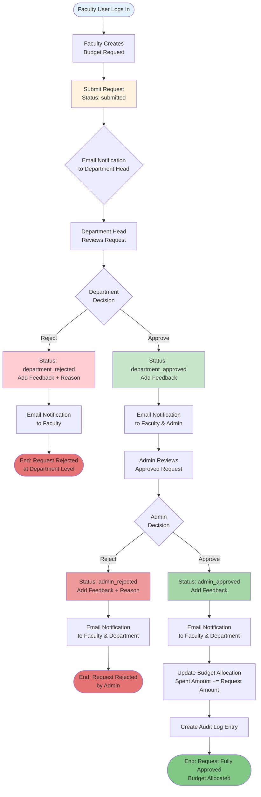
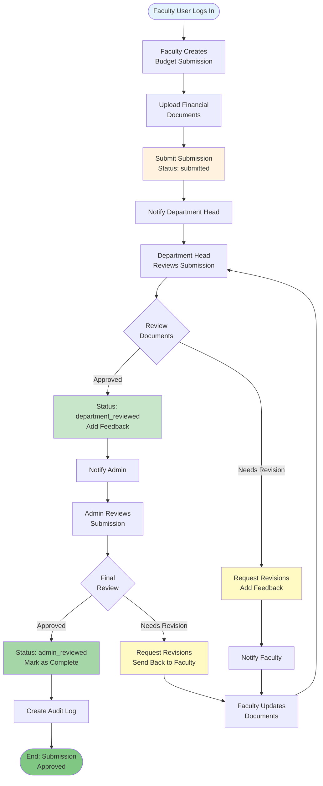
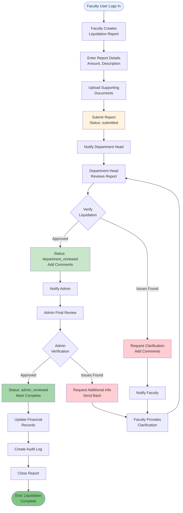
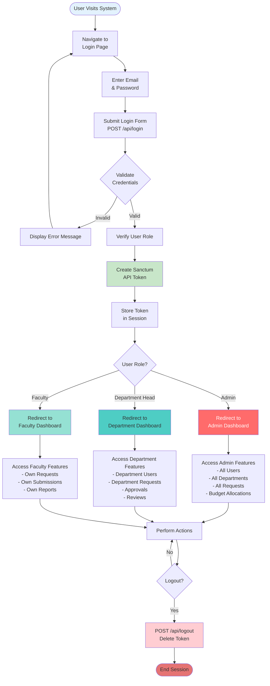
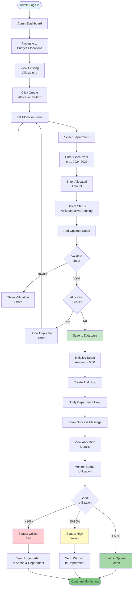
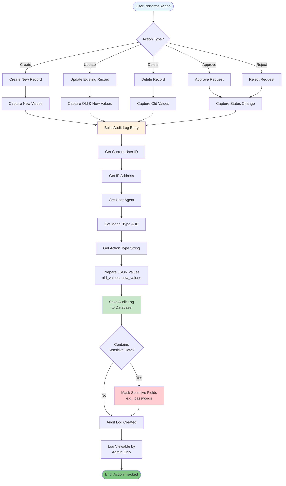
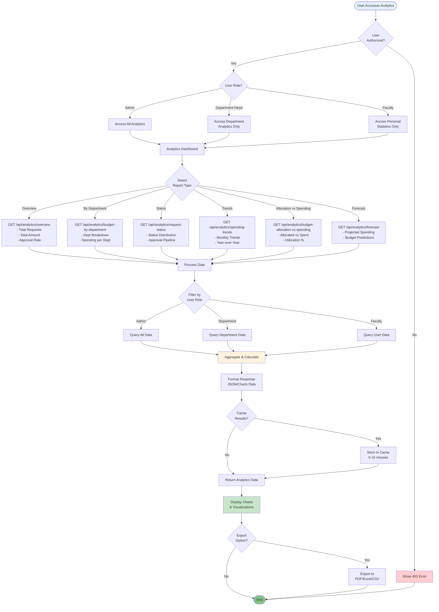

# Budget Tracking System - Process Flowcharts

## 1. Budget Request Approval Workflow



## 2. Budget Submission Review Workflow



## 3. Liquidation Report Review Workflow



## 4. User Authentication Flow



## 5. Budget Allocation Creation Flow



## 6. User Creation Flow (by Admin/Department Head)

```mermaid
flowchart TD
    START([Authorized User Logs In]) --> CHECK_ROLE{User Role?}
    
    CHECK_ROLE -->|Admin| ADMIN_PATH[Admin Can Create<br/>Any User Type]
    CHECK_ROLE -->|Department Head| DEPT_PATH[Dept Head Can Create<br/>Faculty in Their Dept]
    
    ADMIN_PATH --> USER_MENU[Navigate to<br/>User Management]
    DEPT_PATH --> USER_MENU
    
    USER_MENU --> CREATE_BTN[Click Create<br/>User Button]
    CREATE_BTN --> FORM[User Creation Form]
    
    FORM --> NAME[Enter Name]
    NAME --> EMAIL[Enter Email]
    EMAIL --> PASSWORD[Generate/Enter<br/>Password]
    PASSWORD --> ROLE_SELECT{Select<br/>User Role}
    
    ROLE_SELECT -->|Admin Role| ADMIN_CREATE[Create Admin User<br/>No Department Required]
    ROLE_SELECT -->|Dept Head| DEPT_SELECT[Select Department]
    ROLE_SELECT -->|Faculty| DEPT_SELECT
    
    DEPT_SELECT --> AUTH_CHECK{Authorized<br/>for Dept?}
    AUTH_CHECK -->|No| ERROR[Show Authorization<br/>Error]
    AUTH_CHECK -->|Yes| VALIDATE
    
    ADMIN_CREATE --> VALIDATE{Validate<br/>Input}
    
    VALIDATE -->|Invalid| FORM_ERROR[Show Validation<br/>Errors]
    FORM_ERROR --> FORM
    
    VALIDATE -->|Valid| CHECK_EMAIL{Email<br/>Exists?}
    CHECK_EMAIL -->|Yes| DUPLICATE[Show Duplicate<br/>Error]
    DUPLICATE --> FORM
    
    CHECK_EMAIL -->|No| HASH_PASS[Hash Password<br/>with Bcrypt]
    HASH_PASS --> SAVE[Save User to<br/>Database]
    SAVE --> CREATE_TOKEN[Generate Initial<br/>Token (Optional)]
    CREATE_TOKEN --> AUDIT[Create Audit Log]
    AUDIT --> EMAIL_WELCOME[Send Welcome Email<br/>with Credentials]
    EMAIL_WELCOME --> SUCCESS[Show Success Message]
    SUCCESS --> END([End: User Created])
    
    style START fill:#e3f2fd
    style ADMIN_PATH fill:#ff6b6b,color:#fff
    style DEPT_PATH fill:#4ecdc4
    style SAVE fill:#c8e6c9
    style END fill:#81c784
    style ERROR fill:#ffcdd2
    style DUPLICATE fill:#ffcdd2
```

## 7. Data Filtering & Search Flow

```mermaid
flowchart TD
    START([User Views List Page]) --> DISPLAY[Display Records<br/>Default View]
    
    DISPLAY --> FILTER_OPTIONS[Show Filter Options<br/>- Status<br/>- Date Range<br/>- Department<br/>- Amount Range<br/>- Search Text]
    
    FILTER_OPTIONS --> USER_INPUT{User<br/>Applies Filter?}
    USER_INPUT -->|No| DISPLAY
    
    USER_INPUT -->|Yes| SELECT_FILTERS[User Selects<br/>Filter Criteria]
    SELECT_FILTERS --> BUILD_QUERY[Build Query with<br/>Filterable Trait]
    
    BUILD_QUERY --> APPLY_STATUS{Status<br/>Filter?}
    APPLY_STATUS -->|Yes| ADD_STATUS[Add Status<br/>Condition]
    APPLY_STATUS -->|No| APPLY_DATE
    
    ADD_STATUS --> APPLY_DATE{Date Range<br/>Filter?}
    APPLY_DATE -->|Yes| ADD_DATE[Add Date Between<br/>Condition]
    APPLY_DATE -->|No| APPLY_DEPT
    
    ADD_DATE --> APPLY_DEPT{Department<br/>Filter?}
    APPLY_DEPT -->|Yes| ADD_DEPT[Add Department<br/>Condition]
    APPLY_DEPT -->|No| APPLY_AMOUNT
    
    ADD_DEPT --> APPLY_AMOUNT{Amount Range<br/>Filter?}
    APPLY_AMOUNT -->|Yes| ADD_AMOUNT[Add Amount Between<br/>Condition]
    APPLY_AMOUNT -->|No| APPLY_SEARCH
    
    ADD_AMOUNT --> APPLY_SEARCH{Search Text<br/>Provided?}
    APPLY_SEARCH -->|Yes| ADD_SEARCH[Add LIKE Conditions<br/>on Multiple Fields]
    APPLY_SEARCH -->|No| EXECUTE
    
    ADD_SEARCH --> EXECUTE[Execute Query]
    EXECUTE --> RESULTS{Results<br/>Found?}
    
    RESULTS -->|Yes| DISPLAY_RESULTS[Display Filtered<br/>Results]
    RESULTS -->|No| EMPTY[Show No Results<br/>Message]
    
    DISPLAY_RESULTS --> EXPORT_OPTION{Export<br/>Option?}
    EXPORT_OPTION -->|Yes| EXPORT[Export to CSV/PDF]
    EXPORT_OPTION -->|No| END([End])
    
    EMPTY --> CLEAR_FILTER[Option to Clear<br/>Filters]
    CLEAR_FILTER --> DISPLAY
    
    EXPORT --> END
    
    style START fill:#e3f2fd
    style EXECUTE fill:#fff3e0
    style DISPLAY_RESULTS fill:#c8e6c9
    style END fill:#81c784
    style EMPTY fill:#ffcdd2
```



## 8. Audit Log Creation Flow



## 9. Email Notification Flow

```mermaid
flowchart TD
    START([Trigger Event Occurs]) --> EVENT{Event Type?}
    
    EVENT -->|Budget Request<br/>Dept Approved| DEPT_APPROVE_MAIL
    EVENT -->|Budget Request<br/>Dept Rejected| DEPT_REJECT_MAIL
    EVENT -->|Budget Request<br/>Admin Approved| ADMIN_APPROVE_MAIL
    EVENT -->|Budget Request<br/>Admin Rejected| ADMIN_REJECT_MAIL
    
    DEPT_APPROVE_MAIL[Create BudgetRequestApprovedDepartment<br/>Mailable] --> BUILD_DEPT_APP
    DEPT_REJECT_MAIL[Create BudgetRequestRejectedDepartment<br/>Mailable] --> BUILD_DEPT_REJ
    ADMIN_APPROVE_MAIL[Create BudgetRequestApprovedAdmin<br/>Mailable] --> BUILD_ADMIN_APP
    ADMIN_REJECT_MAIL[Create BudgetRequestRejectedAdmin<br/>Mailable] --> BUILD_ADMIN_REJ
    
    BUILD_DEPT_APP[Build Email Content<br/>- Request Details<br/>- Dept Feedback<br/>- Next Steps] --> GET_RECIPIENTS_DEPT_APP
    
    BUILD_DEPT_REJ[Build Email Content<br/>- Request Details<br/>- Rejection Reason<br/>- Dept Feedback] --> GET_RECIPIENTS_DEPT_REJ
    
    BUILD_ADMIN_APP[Build Email Content<br/>- Request Details<br/>- Admin Feedback<br/>- Approval Confirmation] --> GET_RECIPIENTS_ADMIN_APP
    
    BUILD_ADMIN_REJ[Build Email Content<br/>- Request Details<br/>- Rejection Reason<br/>- Admin Feedback] --> GET_RECIPIENTS_ADMIN_REJ
    
    GET_RECIPIENTS_DEPT_APP[Get Recipients<br/>- Faculty User<br/>- Admin] --> QUEUE_DEPT_APP
    
    GET_RECIPIENTS_DEPT_REJ[Get Recipients<br/>- Faculty User] --> QUEUE_DEPT_REJ
    
    GET_RECIPIENTS_ADMIN_APP[Get Recipients<br/>- Faculty User<br/>- Department Head] --> QUEUE_ADMIN_APP
    
    GET_RECIPIENTS_ADMIN_REJ[Get Recipients<br/>- Faculty User<br/>- Department Head] --> QUEUE_ADMIN_REJ
    
    QUEUE_DEPT_APP[Queue Email Job] --> SEND
    QUEUE_DEPT_REJ[Queue Email Job] --> SEND
    QUEUE_ADMIN_APP[Queue Email Job] --> SEND
    QUEUE_ADMIN_REJ[Queue Email Job] --> SEND
    
    SEND[Process Email Queue] --> MAIL_CHECK{Mail<br/>Configuration OK?}
    
    MAIL_CHECK -->|Yes| SEND_EMAIL[Send Email via<br/>SMTP/Mailtrap]
    MAIL_CHECK -->|No| LOG_ERROR[Log Email Error]
    
    SEND_EMAIL --> DELIVERY{Email<br/>Delivered?}
    DELIVERY -->|Yes| SUCCESS[Mark as Sent]
    DELIVERY -->|No| RETRY[Retry (3 attempts)]
    
    RETRY --> RETRY_CHECK{Max<br/>Retries?}
    RETRY_CHECK -->|No| SEND_EMAIL
    RETRY_CHECK -->|Yes| FAIL[Mark as Failed<br/>Log Error]
    
    SUCCESS --> END([End: Notification Sent])
    FAIL --> END
    LOG_ERROR --> END
    
    style START fill:#e3f2fd
    style SEND_EMAIL fill:#fff3e0
    style SUCCESS fill:#c8e6c9
    style END fill:#81c784
    style FAIL fill:#ffcdd2
    style LOG_ERROR fill:#ffcdd2
```

## 10. Analytics & Reporting Flow


