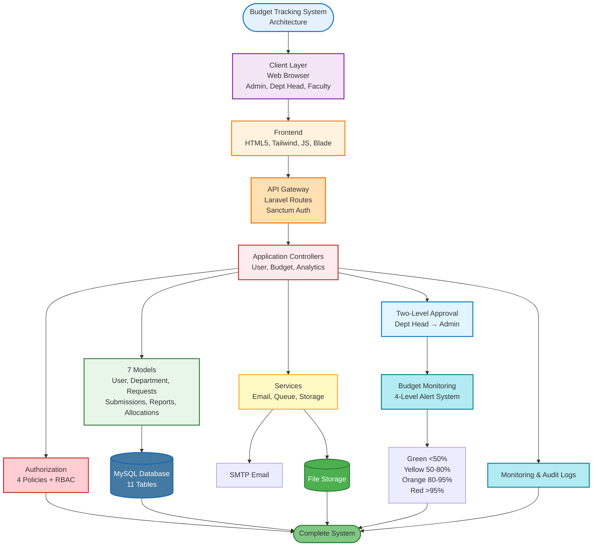

# Budget Tracking System - System Architecture
## For Capstone/Research Paper

---

## System Architecture Diagram

---

## Key Components

### 1. Presentation Layer
**Users:** Admin (full access), Department Head (dept management), Faculty (personal requests)  
**Tech:** HTML5, Tailwind CSS, JavaScript, Alpine.js, Blade Templates

### 2. API Gateway
**Laravel Routes** - RESTful endpoints  
**Sanctum Auth** - API token security

### 3. Application Layer
**9 Controllers:** User, Department, BudgetRequest, BudgetSubmission, LiquidationReport, BudgetAllocation, Approval, AuditLog, Analytics

### 4. Authorization
**4 Policies** - Role-based access control (RBAC)  
**Roles:** Admin, Department Head, Faculty

### 5. Domain Models
**7 Eloquent Models:** User, Department, BudgetRequest, BudgetSubmission, LiquidationReport, BudgetAllocation, AuditLog

### 6. Two-Level Approval Workflow
**Level 1:** Department Head approval  
**Level 2:** Admin final approval

### 7. Budget Monitoring
**4 Alert Levels:**
- Green (<50%) - Optimal
- Yellow (50-80%) - Warning
- Orange (80-95%) - Critical
- Red (>95%) - Danger

**Action:** Auto email notifications

### 8. Services
- Email notifications
- Background job queue
- File storage

### 9. Data Persistence
**MySQL** - 11 tables  
**File Storage** - Documents & uploads

### 10. Monitoring
- Application logs (Monolog)
- Audit logs (user activity)
- Budget alerts (email)

---

## Technology Stack

**Backend:** Laravel 11.x, PHP 8.2+, MySQL  
**Frontend:** HTML5, Tailwind CSS, JavaScript, Alpine.js, Blade  
**Auth:** Laravel Sanctum (API Tokens)  
**Tools:** Composer, Vite, Git, PHPUnit

---

## Key Features

✅ Three-tier role system  
✅ Two-level approval workflow  
✅ Real-time budget monitoring  
✅ Complete audit trail  
✅ Automated email notifications  
✅ Document management  
✅ Analytics & forecasting
