# Budget Tracking System - Unified System Flowchart
## Complete Vertical Flow - For Capstone/Research Paper

---

## Complete End-to-End System Workflow
### Optimized for Bond Paper (Portrait/Vertical Layout)

```mermaid
flowchart TD
    %% ========================================
    %% AUTHENTICATION & LOGIN PHASE
    %% ========================================
    START([BUDGET TRACKING SYSTEM<br/>System Access]) --> LOGIN[User Access Login Page]
    LOGIN --> ENTER_CRED[Enter Login Credentials<br/>Email & Password]
    ENTER_CRED --> VALIDATE_AUTH{Validate<br/>Credentials}
    
    VALIDATE_AUTH -->|Invalid Credentials| AUTH_FAIL[Authentication Failed<br/>Display Error Message]
    AUTH_FAIL --> RETRY_LOGIN{Retry<br/>Login?}
    RETRY_LOGIN -->|Yes| ENTER_CRED
    RETRY_LOGIN -->|No| END_DENIED([Access Denied<br/>Session Terminated])
    
    VALIDATE_AUTH -->|Valid Credentials| CREATE_TOKEN[Create API Token<br/>Laravel Sanctum<br/>Generate Bearer Token]
    CREATE_TOKEN --> STORE_SESSION[Store Session Data<br/>User Information<br/>Authentication Token]
    STORE_SESSION --> GET_USER_ROLE[Retrieve User Role<br/>Query Database]
    
    %% ========================================
    %% ROLE-BASED ROUTING
    %% ========================================
    GET_USER_ROLE --> ROLE_DECISION{Check<br/>User Role}
    
    ROLE_DECISION -->|Role: Admin| LOAD_ADMIN_DASH[Load Admin Dashboard<br/>Full System Access]
    ROLE_DECISION -->|Role: Department Head| LOAD_DEPT_DASH[Load Department Dashboard<br/>Department-Level Access]
    ROLE_DECISION -->|Role: Faculty| LOAD_FACULTY_DASH[Load Faculty Dashboard<br/>Personal Access Only]
    
    %% ========================================
    %% ADMIN WORKFLOW
    %% ========================================
    LOAD_ADMIN_DASH --> ADMIN_MAIN_MENU{ADMIN<br/>Select Function}
    
    ADMIN_MENU -->|User Mgmt| ADMIN_USER[Create/Manage Users<br/>All Roles & Departments]
    ADMIN_USER --> ADMIN_USER_FORM[Enter Details<br/>Validate & Save]
    ADMIN_USER_FORM --> ADMIN_USER_DONE[User Created<br/>Email Sent]
    
    ADMIN_MENU -->|Budget Allocation| ADMIN_ALLOC[Create Allocation]
    ADMIN_ALLOC --> ADMIN_ALLOC_FORM[Select Dept<br/>Fiscal Year & Amount]
    ADMIN_ALLOC_FORM --> ADMIN_VALIDATE_ALLOC{Valid?}
    ADMIN_VALIDATE_ALLOC -->|No| ADMIN_ALLOC_ERROR[Show Errors]
    ADMIN_ALLOC_ERROR --> ADMIN_ALLOC_FORM
    ADMIN_VALIDATE_ALLOC -->|Yes| ADMIN_SAVE_ALLOC[Save Allocation<br/>Notify Dept Head<br/>Log Action]
    ADMIN_SAVE_ALLOC --> ADMIN_ALLOC_DONE[Allocation Created]
    
    ADMIN_MENU -->|Final Approval| ADMIN_REVIEW[Review Dept-Approved Requests]
    ADMIN_REVIEW --> ADMIN_SELECT[Select Request<br/>View Details & Feedback]
    ADMIN_SELECT --> ADMIN_DECISION{Decision}
    
    ADMIN_DECISION -->|Approve| ADMIN_APPROVE[Approve Request<br/>Update Budget<br/>Calculate Utilization]
    ADMIN_APPROVE --> ADMIN_NOTIFY_SUCCESS[Email Faculty & Dept<br/>Log Approval]
    ADMIN_NOTIFY_SUCCESS --> ADMIN_APPROVED[Request Approved<br/>Trigger Monitoring]
    
    ADMIN_DECISION -->|Reject| ADMIN_REJECT[Reject Request<br/>Add Reason]
    ADMIN_REJECT --> ADMIN_NOTIFY_REJECT[Email Faculty & Dept<br/>Log Rejection]
    ADMIN_NOTIFY_REJECT --> ADMIN_REJECTED[Request Rejected]
    
    ADMIN_MENU -->|View Reports| ADMIN_REPORTS[Submissions & Liquidations]
    ADMIN_MENU -->|Analytics| ADMIN_ANALYTICS[System Analytics]
    ADMIN_MENU -->|Audit Logs| ADMIN_AUDIT[View Audit Trail]
    
    ADMIN_USER_DONE --> ADMIN_CONTINUE{Continue?}
    ADMIN_ALLOC_DONE --> ADMIN_CONTINUE
    ADMIN_APPROVED --> ADMIN_CONTINUE
    ADMIN_REJECTED --> ADMIN_CONTINUE
    ADMIN_REPORTS --> ADMIN_CONTINUE
    ADMIN_ANALYTICS --> ADMIN_CONTINUE
    ADMIN_AUDIT --> ADMIN_CONTINUE
    
    ADMIN_CONTINUE -->|Yes| ADMIN_MENU
    ADMIN_CONTINUE -->|No| ADMIN_LOGOUT[Logout & End Session]
    ADMIN_LOGOUT --> SYSTEM_END
    
    %% ========================================
    %% DEPARTMENT HEAD WORKFLOW
    %% ========================================
    DEPT_DASH --> DEPT_MENU{DEPT HEAD<br/>Function}
    
    DEPT_MENU -->|User Mgmt| DEPT_USER[Create Faculty<br/>In Own Dept Only]
    DEPT_USER --> DEPT_USER_FORM[Enter Details<br/>Auto-assign Dept<br/>Validate & Save]
    DEPT_USER_FORM --> DEPT_USER_DONE[Faculty Created]
    
    DEPT_MENU -->|Review Requests| DEPT_REVIEW_REQ[List Dept Requests<br/>Status: submitted]
    DEPT_REVIEW_REQ --> DEPT_SELECT[Select & View Details]
    DEPT_SELECT --> DEPT_DECISION{Decision}
    
    DEPT_DECISION -->|Approve| DEPT_APPROVE[Approve Request<br/>Add Feedback & Timestamp]
    DEPT_APPROVE --> DEPT_NOTIFY[Email Faculty & Admin<br/>Log Approval]
    DEPT_NOTIFY --> DEPT_TO_ADMIN[Queue for Admin Review]
    DEPT_TO_ADMIN --> ADMIN_REVIEW
    
    DEPT_DECISION -->|Reject| DEPT_REJECT[Reject Request<br/>Add Reason]
    DEPT_REJECT --> DEPT_NOTIFY_REJECT[Email Faculty<br/>Log Rejection]
    DEPT_NOTIFY_REJECT --> DEPT_REJECTED[Request Rejected]
    
    DEPT_MENU -->|Review Submissions| DEPT_REVIEW_SUB[Review Documents]
    DEPT_REVIEW_SUB --> DEPT_SUB_DECISION{Valid?}
    DEPT_SUB_DECISION -->|Yes| DEPT_SUB_APPROVE[Mark Reviewed<br/>Notify Admin]
    DEPT_SUB_APPROVE --> DEPT_SUB_DONE[Submission Reviewed]
    DEPT_SUB_DECISION -->|No| DEPT_SUB_REVISE[Request Revision<br/>Notify Faculty]
    DEPT_SUB_REVISE --> DEPT_SUB_REV_DONE[Revision Requested]
    
    DEPT_MENU -->|Review Liquidations| DEPT_REVIEW_LIQ[Review Reports]
    DEPT_REVIEW_LIQ --> DEPT_LIQ_DECISION{Valid?}
    DEPT_LIQ_DECISION -->|Yes| DEPT_LIQ_APPROVE[Mark Reviewed<br/>Notify Admin]
    DEPT_LIQ_APPROVE --> DEPT_LIQ_DONE[Report Reviewed]
    DEPT_LIQ_DECISION -->|No| DEPT_LIQ_ISSUE[Request Clarification<br/>Notify Faculty]
    DEPT_LIQ_ISSUE --> DEPT_LIQ_ISS_DONE[Clarification Requested]
    
    DEPT_MENU -->|View Budget| DEPT_BUDGET[View Allocation & Utilization]
    DEPT_MENU -->|Analytics| DEPT_ANALYTICS[Dept Statistics]
    
    DEPT_USER_DONE --> DEPT_CONTINUE{Continue?}
    DEPT_REJECTED --> DEPT_CONTINUE
    DEPT_SUB_DONE --> DEPT_CONTINUE
    DEPT_SUB_REV_DONE --> DEPT_CONTINUE
    DEPT_LIQ_DONE --> DEPT_CONTINUE
    DEPT_LIQ_ISS_DONE --> DEPT_CONTINUE
    DEPT_BUDGET --> DEPT_CONTINUE
    DEPT_ANALYTICS --> DEPT_CONTINUE
    
    DEPT_CONTINUE -->|Yes| DEPT_MENU
    DEPT_CONTINUE -->|No| DEPT_LOGOUT[Logout & End Session]
    DEPT_LOGOUT --> SYSTEM_END
    
    %% ========================================
    %% FACULTY WORKFLOW
    %% ========================================
    FACULTY_DASH --> FACULTY_MENU{FACULTY<br/>Function}
    
    FACULTY_MENU -->|Create Request| FACULTY_REQUEST[Budget Request Form]
    FACULTY_REQUEST --> FACULTY_REQ_INPUT[Enter Title, Description, Amount]
    FACULTY_REQ_INPUT --> FACULTY_VALIDATE{Valid?}
    FACULTY_VALIDATE -->|No| FACULTY_ERROR[Show Errors]
    FACULTY_ERROR --> FACULTY_REQ_INPUT
    FACULTY_VALIDATE -->|Yes| FACULTY_SUBMIT[Submit Request<br/>Auto-assign Dept<br/>Notify Dept Head<br/>Log Action]
    FACULTY_SUBMIT --> FACULTY_REQ_DONE[Request Submitted]
    FACULTY_REQ_DONE --> DEPT_REVIEW_REQ
    
    FACULTY_MENU -->|Submit Documents| FACULTY_SUBMISSION[Submission Form]
    FACULTY_SUBMISSION --> FACULTY_SUB_INPUT[Enter Details<br/>Upload Documents]
    FACULTY_SUB_INPUT --> FACULTY_SUB_VALIDATE{Valid?}
    FACULTY_SUB_VALIDATE -->|No| FACULTY_SUB_ERROR[Show Upload Errors]
    FACULTY_SUB_ERROR --> FACULTY_SUB_INPUT
    FACULTY_SUB_VALIDATE -->|Yes| FACULTY_SUBMIT_SUB[Save Files<br/>Submit Submission<br/>Notify Dept Head<br/>Log Action]
    FACULTY_SUBMIT_SUB --> FACULTY_SUB_DONE[Submission Created]
    FACULTY_SUB_DONE --> DEPT_REVIEW_SUB
    
    FACULTY_MENU -->|Submit Report| FACULTY_LIQUIDATION[Liquidation Form]
    FACULTY_LIQUIDATION --> FACULTY_LIQ_INPUT[Enter Details<br/>Upload Documents]
    FACULTY_LIQ_INPUT --> FACULTY_LIQ_VALIDATE{Valid?}
    FACULTY_LIQ_VALIDATE -->|No| FACULTY_LIQ_ERROR[Show Errors]
    FACULTY_LIQ_ERROR --> FACULTY_LIQ_INPUT
    FACULTY_LIQ_VALIDATE -->|Yes| FACULTY_SUBMIT_LIQ[Save Files<br/>Submit Report<br/>Notify Dept Head<br/>Log Action]
    FACULTY_SUBMIT_LIQ --> FACULTY_LIQ_DONE[Report Submitted]
    FACULTY_LIQ_DONE --> DEPT_REVIEW_LIQ
    
    FACULTY_MENU -->|View Status| FACULTY_STATUS[View Request Status<br/>Check Feedback]
    FACULTY_MENU -->|View History| FACULTY_HISTORY[View Past Records]
    FACULTY_MENU -->|View Stats| FACULTY_STATS[Personal Statistics]
    
    FACULTY_STATUS --> FACULTY_CONTINUE{Continue?}
    FACULTY_HISTORY --> FACULTY_CONTINUE
    FACULTY_STATS --> FACULTY_CONTINUE
    
    FACULTY_CONTINUE -->|Yes| FACULTY_MENU
    FACULTY_CONTINUE -->|No| FACULTY_LOGOUT[Logout & End Session]
    FACULTY_LOGOUT --> SYSTEM_END
    style ADMIN_REVIEW_DECISION fill:#fff3e0,stroke:#f57c00,stroke-width:2px
    style DEPT_REVIEW_DECISION fill:#fff3e0,stroke:#f57c00,stroke-width:2px
    
    style ADMIN_APPROVE_REQ fill:#c8e6c9,stroke:#43a047,stroke-width:2px
    style DEPT_APPROVE_REQ fill:#c8e6c9,stroke:#43a047,stroke-width:2px
    style ADMIN_APPROVAL_DONE fill:#81c784,stroke:#2e7d32,stroke-width:3px
    
    style ADMIN_REJECT_REQ fill:#ffcdd2,stroke:#e53935,stroke-width:2px
    style DEPT_REJECT_REQ fill:#ffcdd2,stroke:#e53935,stroke-width:2px
    style ADMIN_REJECTION_DONE fill:#e57373,stroke:#c62828,stroke-width:3px
    style DEPT_REJECTION_DONE fill:#e57373,stroke:#c62828,stroke-width:3px
    
    style STATUS_OPTIMAL fill:#c8e6c9,stroke:#43a047,stroke-width:2px
    style STATUS_WARNING fill:#fff9c4,stroke:#f9a825,stroke-width:2px
    style STATUS_CRITICAL fill:#ffe0b2,stroke:#ef6c00,stroke-width:2px
    style STATUS_DANGER fill:#ffcdd2,stroke:#e53935,stroke-width:2px
    style BLOCK_DEPT_REQUESTS fill:#ef9a9a,stroke:#c62828,stroke-width:2px
    
    style END_DENIED fill:#e57373,stroke:#c62828,stroke-width:3px
    style SYSTEM_END fill:#81c784,stroke:#2e7d32,stroke-width:4px
    FACULTY_CONTINUE -->|Yes| FACULTY_MENU
    FACULTY_CONTINUE -->|No| FACULTY_LOGOUT[Logout & End Session]
    FACULTY_LOGOUT --> SYSTEM_END
    
    %% ========================================
    %% BUDGET MONITORING
    %% ========================================
    ADMIN_APPROVED --> MONITOR[Trigger Budget Monitoring]
    MONITOR --> FETCH_ALLOC[Fetch Allocation<br/>Calculate Utilization %]
    FETCH_ALLOC --> CHECK_UTIL{Check<br/>Level}
    
    CHECK_UTIL -->|< 50%| OPTIMAL[OPTIMAL Green<br/>No Action]
    CHECK_UTIL -->|50-80%| WARNING[WARNING Yellow<br/>Email Dept Head]
    CHECK_UTIL -->|80-95%| CRITICAL[CRITICAL Orange<br/>Email Dept & Admin]
    CHECK_UTIL -->|> 95%| DANGER[DANGER Red<br/>Urgent Alert]
    
    DANGER --> CHECK_DEPLETED{100%<br/>Depleted?}
    CHECK_DEPLETED -->|Yes| BLOCK[Block New Requests<br/>Notify Budget Depleted]
    CHECK_DEPLETED -->|No| UPDATE_DASH
    
    OPTIMAL --> UPDATE_DASH[Update Dashboard<br/>Log Status]
    WARNING --> UPDATE_DASH
    CRITICAL --> UPDATE_DASH
    BLOCK --> UPDATE_DASH
    
    UPDATE_DASH --> MONITOR_DONE[Monitoring Complete]
    MONITOR_DONE --> SYSTEM_END
    
    %% ========================================
    %% STYLING
    %% ========================================
    style START fill:#e3f2fd,stroke:#1976d2,stroke-width:4px
    style VALIDATE_AUTH fill:#fff3e0,stroke:#f57c00,stroke-width:2px
    style ROLE_DECISION fill:#f3e5f5,stroke:#7b1fa2,stroke-width:2px
    
    style ADMIN_DASH fill:#ffebee,stroke:#c62828,stroke-width:3px
    style DEPT_DASH fill:#e0f7fa,stroke:#00838f,stroke-width:3px
    style FACULTY_DASH fill:#e8f5e9,stroke:#2e7d32,stroke-width:3px
    
    style ADMIN_MENU fill:#f3e5f5,stroke:#7b1fa2,stroke-width:2px
    style DEPT_MENU fill:#f3e5f5,stroke:#7b1fa2,stroke-width:2px
    style FACULTY_MENU fill:#f3e5f5,stroke:#7b1fa2,stroke-width:2px
    
    style ADMIN_DECISION fill:#fff3e0,stroke:#f57c00,stroke-width:2px
    style DEPT_DECISION fill:#fff3e0,stroke:#f57c00,stroke-width:2px
    
    style ADMIN_APPROVE fill:#c8e6c9,stroke:#43a047,stroke-width:2px
    style DEPT_APPROVE fill:#c8e6c9,stroke:#43a047,stroke-width:2px
    style ADMIN_APPROVED fill:#81c784,stroke:#2e7d32,stroke-width:3px
    
    style ADMIN_REJECT fill:#ffcdd2,stroke:#e53935,stroke-width:2px
    style DEPT_REJECT fill:#ffcdd2,stroke:#e53935,stroke-width:2px
    style ADMIN_REJECTED fill:#e57373,stroke:#c62828,stroke-width:3px
    style DEPT_REJECTED fill:#e57373,stroke:#c62828,stroke-width:3px
    
    style OPTIMAL fill:#c8e6c9,stroke:#43a047,stroke-width:2px
    style WARNING fill:#fff9c4,stroke:#f9a825,stroke-width:2px
    style CRITICAL fill:#ffe0b2,stroke:#ef6c00,stroke-width:2px
    style DANGER fill:#ffcdd2,stroke:#e53935,stroke-width:2px
    style BLOCK fill:#ef9a9a,stroke:#c62828,stroke-width:2px
    
    style END_DENIED fill:#e57373,stroke:#c62828,stroke-width:3px
    style SYSTEM_END fill:#81c784,stroke:#2e7d32,stroke-width:4px
    CHECK_UTIL -->|50-80%| WARNING[WARNING Yellow<br/>Email Dept Head]
    CHECK_UTIL -->|80-95%| CRITICAL[CRITICAL Orange<br/>Email Dept & Admin]
    CHECK_UTIL -->|> 95%| DANGER[DANGER Red<br/>Urgent Alert]
    
    DANGER --> CHECK_DEPLETED{100%<br/>Depleted?}
    CHECK_DEPLETED -->|Yes| BLOCK[Block New Requests<br/>Notify Budget Depleted]
    CHECK_DEPLETED -->|No| UPDATE_DASH
    
    OPTIMAL --> UPDATE_DASH[Update Dashboard<br/>Log Status]
    WARNING --> UPDATE_DASH
    CRITICAL --> UPDATE_DASH
    BLOCK --> UPDATE_DASH
    
    UPDATE_DASH --> MONITOR_DONE[Monitoring Complete]
    
    %% ========================================
    %% SYSTEM END
    %% ========================================
    MONITOR_DONE --> SYSTEM_END([SYSTEM COMPLETE])
    %% ========================================
    PRIMARY_DB --> EXTERNAL[EXTERNAL SERVICES LAYER<br/>SMTP Server: Mailtrap/Gmail Port 587<br/>Cloud Storage: AWS S3/Local<br/>Email Delivery + File Backup]
    FILE_STORAGE --> EXTERNAL
    CACHE_STORE --> EXTERNAL
    
    %% ========================================
    %% INFRASTRUCTURE LAYER
    %% ========================================
    EXTERNAL --> INFRASTRUCTURE[INFRASTRUCTURE LAYER<br/>Laravel 11.x PHP 8.2+<br/>Composer Dependency Manager<br/>Vite Asset Bundler<br/>Git Version Control<br/>PHPUnit Testing Framework]
    
    %% ========================================
    %% SECURITY LAYER
    %% ========================================
    %% STYLING
    %% ========================================
    style START fill:#e3f2fd,stroke:#1976d2,stroke-width:4px
    style VALIDATE_AUTH fill:#fff3e0,stroke:#f57c00,stroke-width:2px
    style ROLE_DECISION fill:#f3e5f5,stroke:#7b1fa2,stroke-width:2px
    
    style ADMIN_DASH fill:#ffebee,stroke:#c62828,stroke-width:3px
    style DEPT_DASH fill:#e0f7fa,stroke:#00838f,stroke-width:3px
    style FACULTY_DASH fill:#e8f5e9,stroke:#2e7d32,stroke-width:3px
    
    style ADMIN_MENU fill:#f3e5f5,stroke:#7b1fa2,stroke-width:2px
    style DEPT_MENU fill:#f3e5f5,stroke:#7b1fa2,stroke-width:2px
    style FACULTY_MENU fill:#f3e5f5,stroke:#7b1fa2,stroke-width:2px
    
    style ADMIN_DECISION fill:#fff3e0,stroke:#f57c00,stroke-width:2px
    style DEPT_DECISION fill:#fff3e0,stroke:#f57c00,stroke-width:2px
    
    style ADMIN_APPROVE fill:#c8e6c9,stroke:#43a047,stroke-width:2px
    style DEPT_APPROVE fill:#c8e6c9,stroke:#43a047,stroke-width:2px
    style ADMIN_APPROVED fill:#81c784,stroke:#2e7d32,stroke-width:3px
    
    style ADMIN_REJECT fill:#ffcdd2,stroke:#e53935,stroke-width:2px
    style DEPT_REJECT fill:#ffcdd2,stroke:#e53935,stroke-width:2px
    style ADMIN_REJECTED fill:#e57373,stroke:#c62828,stroke-width:3px
    style DEPT_REJECTED fill:#e57373,stroke:#c62828,stroke-width:3px
    
    style OPTIMAL fill:#c8e6c9,stroke:#43a047,stroke-width:2px
    style WARNING fill:#fff9c4,stroke:#f9a825,stroke-width:2px
    style CRITICAL fill:#ffe0b2,stroke:#ef6c00,stroke-width:2px
    style DANGER fill:#ffcdd2,stroke:#e53935,stroke-width:2px
    style BLOCK fill:#ef9a9a,stroke:#c62828,stroke-width:2px
    
    style END_DENIED fill:#e57373,stroke:#c62828,stroke-width:3px
    style SYSTEM_END fill:#81c784,stroke:#2e7d32,stroke-width:4pxke-width:3px
```

---

## Flowchart Legend

### Status Colors
- 🔵 **Blue** - System Start/Entry Points
- 🟣 **Purple** - Decision Points/User Choices
- 🔴 **Red** - Admin Functions/Highest Authority
- 🟡 **Cyan** - Department Head Functions
- 🟢 **Green** - Faculty Functions/Success States
- 🟠 **Orange** - Validation/Error States
- ⚫ **Dark Red** - Rejection/End States

### Process Flow
1. **Authentication** → User logs in with credentials
2. **Role-Based Routing** → System determines user role and loads appropriate dashboard
3. **Admin Workflow** → Full system access, budget allocation, final approval
4. **Department Workflow** → Department-level reviews and approvals
5. **Faculty Workflow** → Submit requests, documents, and reports
6. **Monitoring** → Real-time budget utilization monitoring with alerts
7. **Session End** → User logout and session termination

### Key Decision Points
- **Authentication Check** - Valid/Invalid credentials
- **Role Decision** - Admin/Department Head/Faculty
- **Approval Decisions** - Approve/Reject at each level
- **Budget Utilization** - 4 alert levels (Optimal/Warning/Critical/Danger)

---

## Architecture Layers Explanation

### 1. Client/Presentation Layer
- **Web Browser Interface** - User-facing frontend
- **Frontend Technologies** - HTML5, Tailwind CSS, JavaScript, Alpine.js, Blade
- **API Client** - Mobile/external system integration

### 2. API Gateway Layer
- **Laravel Routes** - RESTful API endpoint definitions
- **Middleware** - Request processing pipeline
- **Authentication** - Sanctum token-based auth
- **Request Filtering** - CORS, rate limiting, logging

### 3. Application/Business Logic Layer
- **Controllers** - 9 controllers handling all operations
- **Policies** - 4 authorization policies for access control
- **Models** - 7 Eloquent models representing business entities
- **Services** - Mail, Queue, Cache, Storage, Filtering

### 4. Data Persistence Layer
- **MySQL Database** - Primary relational data store (Port 3307)
- **File Storage** - Document repository for uploads
- **Cache Store** - Redis/Memcached for performance

### 5. External Services Layer
- **SMTP Server** - Email delivery (Mailtrap/Gmail)
- **Cloud Storage** - AWS S3 / Local storage for file backup

### 6. Infrastructure Layer
- **Laravel Framework** - PHP 8.2+ framework
- **Composer** - PHP dependency management
- **Vite** - Frontend asset bundling
- **Git** - Version control
- **PHPUnit** - Testing framework

### 7. Security Layer
- **Authentication Security** - Bcrypt hashing, token auth, CSRF protection
- **Authorization Security** - RBAC, policies, department isolation
- **Data Security** - Encryption, validation, audit logging

### 8. Monitoring & Logging Layer
- **Application Logging** - Monolog with multiple channels
- **Audit Logging** - Complete activity tracking
- **Performance Monitoring** - Query optimization, metrics
- **Budget Monitoring** - Real-time utilization alerts

---

## Notes for Capstone/Research Paper

This unified architecture diagram represents the complete system architecture of the Budget Tracking System in a single, continuous vertical flow. The diagram is optimized for bond paper printing in portrait orientation and shows:

1. **Layered Architecture** - Clear separation of concerns across 8 distinct layers
2. **Complete Technology Stack** - All frameworks, libraries, and services used
3. **Data Flow** - How data flows from client to database and back
4. **Security Implementation** - Multiple security layers and features
5. **Scalability Features** - Caching, queuing, and monitoring systems
6. **Integration Points** - External services and API clients

The architecture demonstrates a modern, secure, and scalable Laravel-based system with comprehensive features including authentication, authorization, audit logging, email notifications, file management, and real-time monitoring.
